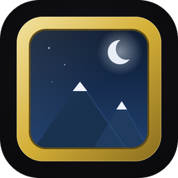
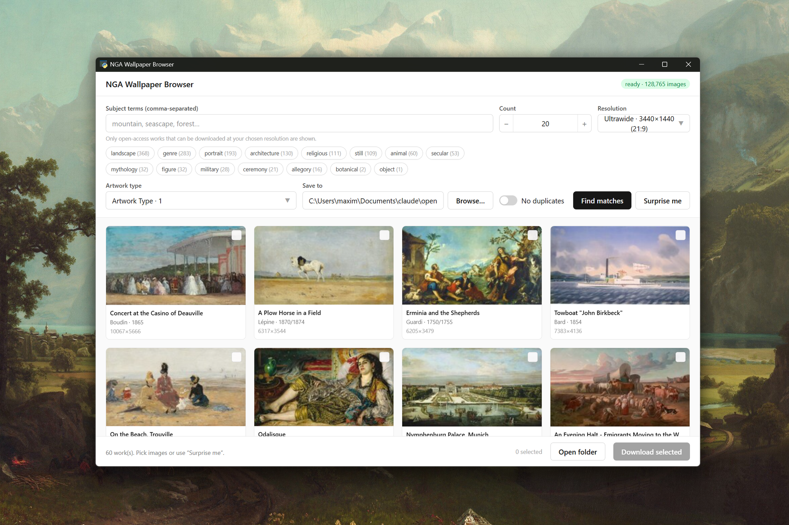

# NGA Wallpapers



Browse the National Gallery of Art's open-access collection and download artworks
as pixel-exact desktop wallpapers, center-cropped to your screen's resolution via
the NGA IIIF image API and never upscaled.



## Why I built it

I wanted a fresh rotation of high-resolution art on my OLED monitor. Static
desktops risk burn-in on OLED, so a steady supply of varied, correctly-sized
wallpapers is both nicer to look at and easier on the panel. This app finds works
that actually make good wallpapers, crops them exactly to my resolution, and drops
them in a folder I point the OS slideshow at.

It was also an experiment in building a UI without ever opening Figma. The whole
interface was created purely by prompting and iterating against component and
library docs (Base UI, Tailwind) rather than from a visual design tool. The current
look is functional and intentionally plain; I plan to add my own design pass later.

## What it does

- **Browse 68,000+ open-access works.** Filter by **Artwork Type** (Print,
  Photograph, Drawing, Painting, Sculpture, and more) with live counts, and search
  **Subjects** with autocomplete plus clickable **tag chips that show how many
  matching works exist under your current filters**. Leave the search empty to
  browse everything.
- **Only surfaces works that make clean wallpapers:** landscape orientation,
  open-access rights, and a source image at least as large as your target
  resolution, so nothing is ever upscaled.
- **Resolution presets:** 1080p (1920x1080), 1440p (2560x1440), 4K (3840x2160),
  5K (5120x2880), and Ultrawide 21:9 (3440x1440).
- **Preview modal:** see a large version with title, artist, year, medium, and
  accession number, and download just that one image.
- **Exact cropping and batch download:** each pick is center-cropped to your exact
  aspect ratio via IIIF and saved at full resolution. "Surprise me" grabs a random
  selection; "No duplicates" keeps one image per artwork.

## Set up the wallpaper rotation (OLED)

The app fills a download folder; your OS handles the rotation:

- **Windows:** Settings > Personalization > Background > **Slideshow**, choose the
  download folder, turn on **Shuffle**, and set a rotation interval.

Varying the wallpaper on a schedule is the part that keeps a static image from
sitting on an OLED panel for hours.

## Getting started

**Prerequisites:** Python 3.x, Node 18+, and Windows (the desktop shell uses
WebView2 via [pywebview](https://pywebview.flowrl.com/); "Open folder" uses
`os.startfile`).

**1. Get the collection data.** The CSVs are not checked in (they're large and
re-downloadable). Grab them from the
[NGA Open Data repo](https://github.com/NationalGalleryOfArt/opendata) and place at
least these three into a `data/` folder at the repo root:

```
data/objects.csv
data/published_images.csv
data/objects_terms.csv
```

(These are exactly what `load_data()` in `scripts/download_wallpapers.py` reads.)

**2. Install Python dependencies.**

```
pip install -r requirements.txt
```

**3. Build the frontend.**

```
cd frontend
npm install
npm run build
```

**4. Run the app.**

```
python scripts/wallpaper_web.py
```

For frontend development with hot reload, run the Vite dev server and point the
shell at it:

```
cd frontend && npm run dev          # terminal 1
python scripts/wallpaper_web.py --dev   # terminal 2
```

## Other ways to use it

- **Command line (no GUI):**

  ```
  python scripts/download_wallpapers.py \
    --terms landscape,seascape --classifications Painting \
    --width 3840 --height 2160 --limit 20
  ```

  Also supports `--no-duplicates` and `--min-height`.

- **Tkinter variant:** `python scripts/wallpaper_gui.py`, the same backend behind a
  simple native GUI.

## How it works

A React 19 + [Base UI](https://base-ui.com/) + Tailwind 4 frontend (built with
Vite, TypeScript) is rendered in a native window by Python + pywebview, which
exposes a small bridge to the backend. [pandas](https://pandas.pydata.org/) filters
the collection CSVs, and the actual images are fetched and cropped through the NGA
[IIIF](https://iiif.io/) image API. The data-extraction side of the pipeline is
documented in [ARCHITECTURE.md](ARCHITECTURE.md).

## Packaging (optional)

A committed PyInstaller spec builds the standalone Windows executable (one-file,
windowed, with the app icon baked in):

```
pyinstaller --noconfirm WallpaperBrowser.spec
```

Keep the built `frontend/dist` and the `data/` folder next to the resulting
`WallpaperBrowser.exe` — the app loads them from alongside the executable. The
running window also uses the same icon via pywebview, and the frontend favicon
lives at `frontend/public/favicon.svg`.

## Data & license

Built on the **National Gallery of Art Open Data Program**, released under
[Creative Commons Zero (CC0 1.0)](https://creativecommons.org/publicdomain/zero/1.0/);
see [`LICENSE`](LICENSE). The dataset describes the 130,000+ artworks in the NGA
collection and the artists who created them; please consider citing the
[NGA Collection Dataset](https://github.com/NationalGalleryOfArt/opendata) when
using the data. Images and media files are **not** part of the dataset; it contains
only links and references, which this app resolves through IIIF (and only
open-access works can be downloaded at full resolution).

Note: `scripts/extract_opendata.py` and `scripts/refresh_github_extract.bash` are
NGA-internal tooling for regenerating the dataset from its collection database; they
are **not** needed to run the wallpaper app.
